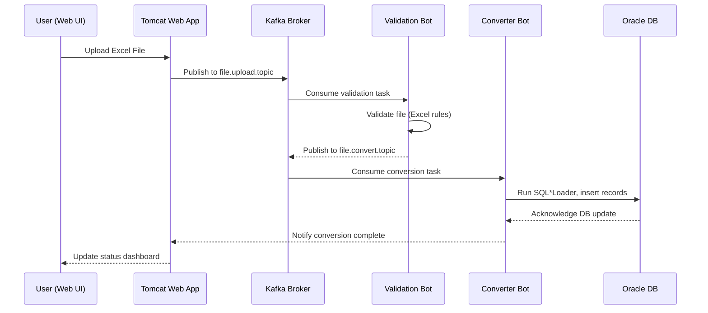

**Technical Documentation: Tomcat ↔ Kafka Communication Flow**

### 1. Overview
This document outlines the end-to-end communication flow between the **Web Application (Tomcat)** and **Kafka-based background services (Validation Bot / Converter Bot)**. The architecture ensures scalable, asynchronous file validation and conversion without blocking user requests.

---

### 2. High-Level Architecture

**Components:**
- **Frontend (Web UI)** – User uploads Excel files and views status.
- **Tomcat (Spring Boot Web App)** – Handles file upload requests and publishes job messages to Kafka.
- **Kafka Broker** – Acts as the message queue for asynchronous task processing.
- **Worker Bots (Validation-Bot / Converter-Bot)** – Consume messages from Kafka, process files, and update the database.
- **Oracle Database** – Stores validation logs, metadata, and final data after conversion.

---

### 3. Sequence Flow
1. **User Uploads File** via web UI.
2. **Tomcat Application** validates basic metadata (size, name, extension).
3. **Spring Boot Producer** sends a JSON message to the Kafka topic, e.g. `file.upload.topic`.
4. **Kafka Broker** stores and replicates the message across its partitions.
5. **Validation-Bot Consumer** listens to the topic, downloads the file path, and validates its structure.
6. If valid, the bot publishes another message to `file.convert.topic`.
7. **Converter-Bot** consumes from this topic, converts the validated file into CTL/CSV, and triggers SQL*Loader.
8. **Oracle DB** stores processed records; logs are updated for traceability.
9. **Tomcat Web App** polls job status and displays real-time updates to the user.

---

### 4. Message Schema (Kafka Topics)

**Topic:** `file.upload.topic`
```json
{
  "fileName": "eposttran_2025_01.xlsx",
  "branchCode": "BR001",
  "uploadPath": "D:/data/uploads/",
  "uploadedBy": "USER123",
  "timestamp": "2025-10-28T10:15:00"
}
```

**Topic:** `file.convert.topic`
```json
{
  "fileName": "eposttran_2025_01.xlsx",
  "validatedPath": "D:/data/validated/",
  "status": "VALIDATED",
  "triggeredBy": "ValidationBot",
  "timestamp": "2025-10-28T10:20:00"
}
```

---

### 5. Mermaid Diagram


---

### 6. Configuration

**application.yml (Tomcat):**
```yaml
spring:
  kafka:
    bootstrap-servers: localhost:9092
    producer:
      key-serializer: org.apache.kafka.common.serialization.StringSerializer
      value-serializer: org.apache.kafka.common.serialization.StringSerializer
    consumer:
      group-id: file-validation-group
      auto-offset-reset: earliest
```

**sqlldr.yml (Converter-Bot):**
```yaml
sqlldr:
  bin: C:\Oracle\bin\sqlldr.exe
  user: SBBD_IUT
  password: SB5leEsp4
  connect: 172.31.36.145:1521/SILDB
  direct: true
  parallel: true
  charset: AL32UTF8
```

---

### 7. Error Handling
| Stage | Possible Error | Recovery Strategy |
|-------|----------------|------------------|
| File Upload | Invalid file type or size | Reject upload with message |
| Kafka Publish | Broker unavailable | Retry with exponential backoff |
| Validation | Missing columns | Move to error folder, update DB |
| Conversion | SQL*Loader fail | Log error, send alert email |
| Database | Connection timeout | Reconnect or mark job as FAILED |

---

### 8. Key Advantages
- Asynchronous processing for large batch uploads
- Decoupled architecture with Kafka ensuring resilience
- Scalable design allowing horizontal worker scaling
- Clear error segregation and automated recovery paths

---

### 9. Future Enhancements
- Introduce REST-based status polling instead of DB query.
- Implement dead-letter queues (DLQ) for failed messages.
- Integrate Prometheus + Grafana dashboards for real-time monitoring.
- Add retry-policy-based validation bot clustering.

---
**Document Owner:** Systems Integration Team  
**Version:** 1.0.0  
**Date:** October 28, 2025

